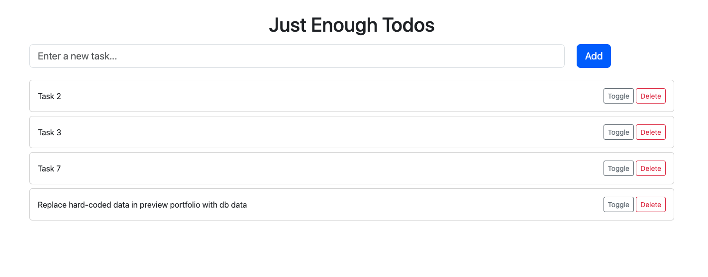
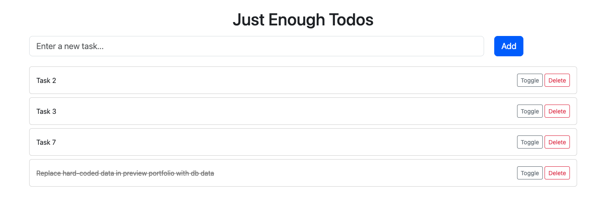

# JE-Todo


A simple Java Spring Boot application implementing CRUD operations with the following technologies:

- **Thymeleaf** for web page templating
- **MySQL** as the database
- **Lombok** for reducing boilerplate code

This application is a basic **To-Do List Manager** where users can create, view, update, and delete tasks.

---

## Features
1. **Add a Task**: Users can create new tasks by entering the task name and description.
2. **View All Tasks**: A list of all tasks is displayed on the main page.
3. **Update a Task**: Users can toggle the completion status of an existing task.
4. **Delete a Task**: Tasks can be removed from the list.

---

## Technologies Used
- **Spring Boot 3.4.0**: Backend framework
- **Thymeleaf**: Template engine for rendering web pages
- **MySQL**: Relational database management system
- **Lombok**: Simplifies Java model creation with annotations

---

## Prerequisites
1. Install **Java 21** or later.
2. Install **Maven**.
3. Set up a **MySQL database** and create a database named `todo_db`.

---
## Configuration
1. Configure your MySQL database in the `application.properties` file:

   ```properties
   spring.datasource.url=jdbc:mysql://localhost:3306/todo_db
   spring.datasource.username=<your-username>
   spring.datasource.password=<your-password>
   spring.jpa.hibernate.ddl-auto=update
   spring.jpa.show-sql=true
   ```


---
## Endpoints
| **HTTP Method** | **Endpoint**       | **Description**                   |
|-----------------|--------------------|-----------------------------------|
| `GET`           | `/`                | View all tasks                    |
| `POST`          | `/`                | Add a new task                    |
| `GET`           | `/{id}/delete`     | Delete an existing task           |
| `GET`           | `/{id}/toggle` | Toggle completion a specific task |


---
## Screenshots
### Tasks


### Toggle Task Completion


## Lombok Setup

If your IDE doesn't automatically recognize Lombok annotations, ensure that the Lombok plugin is installed and enabled in your IDE.

### Steps for Lombok Setup:

#### 1. **Install the Lombok Plugin:**

- **For IntelliJ IDEA:**
    1. Go to `File > Settings > Plugins`.
    2. Search for "Lombok" and install it.

- **For Eclipse:**
    1. Go to `Help > Eclipse Marketplace`.
    2. Search for "Lombok" and install it.

#### 2. **Enable Annotation Processing:**

- **In IntelliJ IDEA:**
    1. Go to `File > Settings > Build, Execution, Deployment > Compiler > Annotation Processors`.
    2. Enable Annotation Processing.

- **In Eclipse:**
    - This is enabled by default.

## Future Improvements and Features

This project will continue to evolve and become more robust. The following features are planned for future versions:

- **User Management**: Integration of a user system where users can create accounts, log in, and manage their own tasks and todo lists.
- **Todo and Task Ownership**: Each todo list and task will be assigned to specific users, allowing for better tracking and management.
- **Multiple Users per Todo List**: Todo lists will support multiple users, enabling collaboration on tasks. Multiple people will be able to own and contribute to a single todo list.
- **Task Completion Tracking**: A todo list will be marked as "completed" only when all members have finished their individual tasks, ensuring team collaboration and accountability.
- **Sharing Task Lists**: Users will be able to share their todo lists with others, allowing for seamless cooperation on tasks and projects.

These enhancements will improve the functionality and scalability of the project, making it suitable for personal, team, and organizational use.

## Contact Me

If you have any questions, suggestions, or feedback regarding this project, feel free to reach out:

- **Email**: your.email@example.com
- **GitHub**: [Your GitHub Profile](https://github.com/EQua-Dev)
- **LinkedIn**: [Your LinkedIn Profile](https://www.linkedin.com/in/richard-uzor/)
- **X (Formerly Twitter)**: [@richard_eQua](https://x.com/richard_eQua)

I am always open to collaboration and discussions about improving the project. Don't hesitate to get in touch!
